# Lucky Roll Dice Game - ReadME

[Access the live site here.](https://craig90dev.github.io/higher-or-lower/)

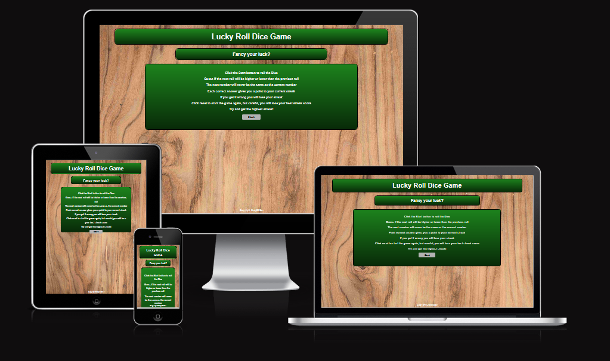

This is the documentation for the Lucky Roll Dice Game website. Built using HTML5, CSS3 and Javascript for the Milestone 2 Project for Code Institutes Web Development Diploma course. 

******

## Contents

* [The User Experience](#the-user-experience)
    * [Strategy](#strategy)
    * [Scope](#scope)
    * [Structure](#structure)
    * [Skeleton](#skeleton)
* [The User Interface](#the-user-interface)
    * [Surface](#surface)
* [Features](#features)
    * [Page Navigation](#page-navigation)
    * [Navigation](#navigation)
    * [Game Interface](#game-interface)
    * [Correct/Incorrect (Results)](#correctincorrect-result)
    * [Dice Total](#dice-total)
* [Future Implementations](#future-implementations)
* [Accessibility](#accessibility)
* [Technologies Used](#technologies-used)
* [Deployment and Local Development](#deployment-and-local-development)
    * [Deployment](#deployment)
    * [Local Deployment](#local-deployment)
* [Testing](#testing)
    * [Validation](#validation)
    * [Lighthouse](#lighthouse)
    * [Devices Used](#devices-used)
    * [Manual Testing](#manual-testing)
* [Issues/Bugs](#issues\/bugs)
    * [Fixed Issues](#fixed-issues)
    * [Known Bugs](#known-bugs)
* [Credits](#credits)
    * [Help Used](#help-used)
    * [Media](#media)
    * [Acknowledgements](#acknowledgements)

******

## The User Experience

### Strategy

This project is designed with the aim to showcase the my skills and progression in learning the Javascript coding language through the Code Institute web development diploma course with a simple game, using my own resources and knowledge to create a simple higher or lower game to showcase my Javascript abilities and create a user friendly interface using the HTML and CSS skills I have learnt from the previous module.

#### - User Stories

**First Time Visitor goals** -

a. As a first time visitor I want to be able to easily understand the game interface and how to play the game.

b. I want to be able to use the keyboard to play the game to save me from using my mouse.

c. I want to be able to see my high score.

**Returning Visitor goals** -

a. As a returning visitor I want to be able to see my previous high score.

b. I want to be able to play the gmae on my mobile device or desktop.

**Frequent Visiter goals** -

a. As a frequent visitor I want to see visual updates and new features being added to the game.

******

### Scope

Taking the user goals into account I decided to create the game on a single page, making HTML elements appear and disappear as necessary to save the user from loading new pages to navigate the game interface.

I added a "Best Streak" element to keep track of the players highest score and a reset button to take the player back to the instructions interface and reset the Best Streak.

I also added the option to use the Left and Right arrow keys accordingly for the player to be able to play using the keyboard instead of the mouse.

The game is responsive to allow players to play the game on either their mobile device or desktop computer.

******

### Structure

The website is simple and loads with instructions on how to play and a start button. Once the game interface is loaded, there are two buttons for the player to choose from in order to play the game and a reset button below to allow the user to clearly reset the game if needed. The dice images are central with the total of the dice displayed below so the user can easily see what the current number they have to guess for.

******

#### Wireframes

All Wireframes have been created using [Balsamiq](https://balsamiq.com/).

**Luck Roll Dice Game Wireframes**

Desktop View

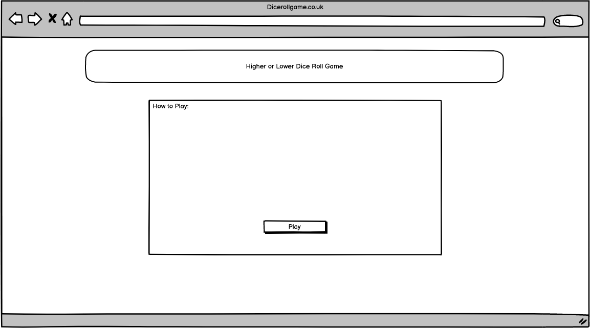

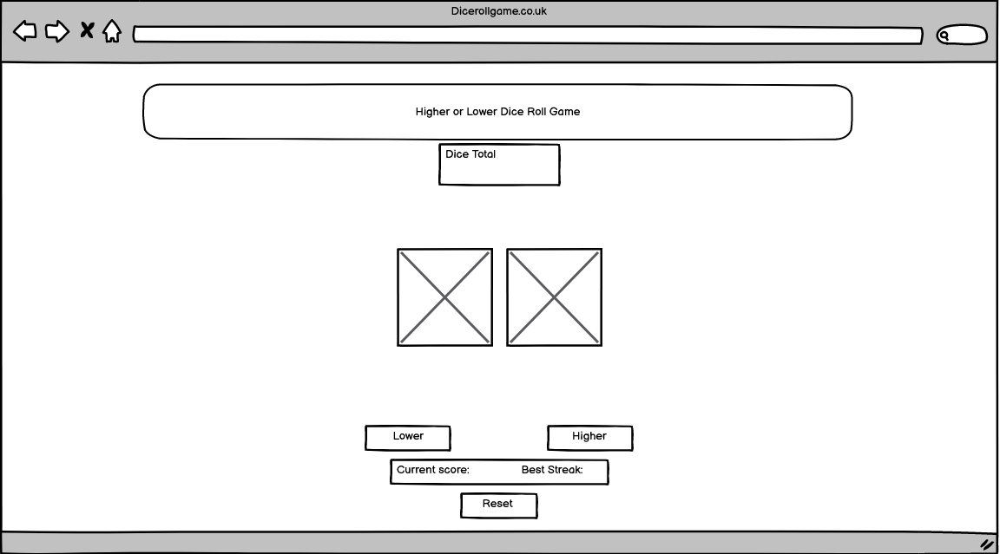

Mobile View

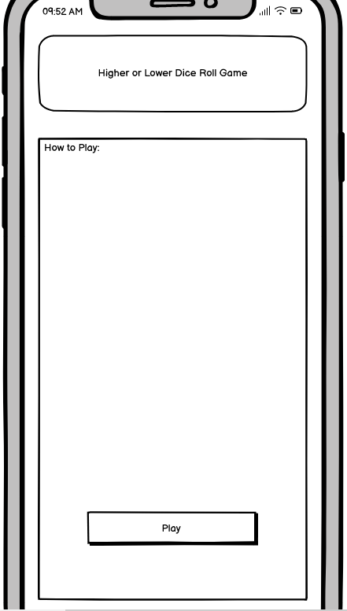

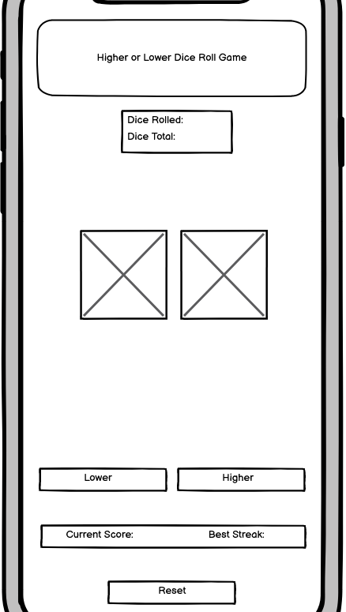

The wireframes shown here are the ideas for the initial layout of the game. Some styling has been changed since testing to allow for a better user experience and improve accessibility.

[*Back to top*](#contents)

******

## The User Interface

### Surface

#### Colours

I used a bright wooden style image from: [Pexels](https://www.pexels.com/photo/brown-wooden-surface-129733/) for the background to replicate the game interface being played on a table.

**#1d831d, #082a08** - I chose these shades of green and added a linear gradient for the container elements to replicate the felt of a poker table.

**#ffffff** - I chose white for the all text in the game (with the exception of the button text) as it is simple and easy to read with the coloured background.

******

#### Typography

The fonts have been imported from [Google Fonts](https://fonts.google.com/).

The 'Open-sans' font has been used for the generic content text of the website. I chose this font as it is easy to read and provides the user with a slightly different font to a generic website font. The 'sans-serif' font is used as the fallback font as a generic content font.

[*Back to top*](#contents)

******

## Features

### Navigation

The site has two buttons (Start and Reset) in order to Navigate between the instructions and game interfaces as required.

### Game Interface

Game Interface in Desktop view

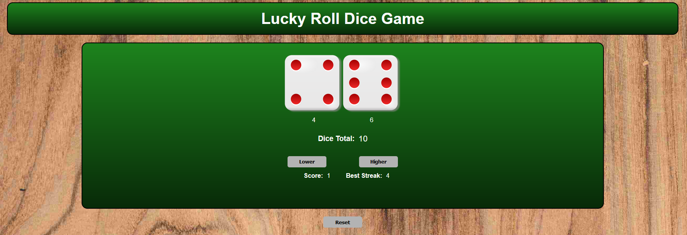

Game Interface in Mobile view

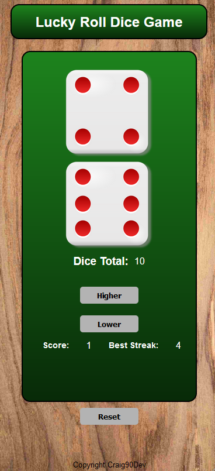

The Game Interface differs depending on the device the game is being played on. The desktop view shows all elements, where the mobile view shows the dice images in a column and the total of the dice is hidden in order for the game to fit on the screen properly without being too small.

### Correct/Incorrect (Result)

Correct Result Element

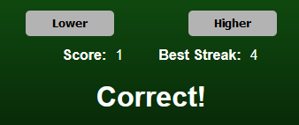

Incorrect Result Element

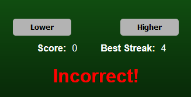

The result element only appears when the player has made a choice. The result is shown for a second using the timeOut function before being hidden again. The result text is coloured to depict whether the player got the answer correct or incorrect (Correct being white and Incorrect being red).

### Dice Total

Dice Total Element

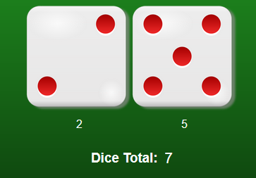

The dice total is displayed below the dice images in order to save the player having to manually count the dots on each dice and add them together.

## Future Implementations

1. To add the ability to add more dice in order to change the difficulty of the game.

2. To add the option to allow the player to enter their name or initials and keep high scores saved locally.

3. To add a high score display/section on button click to display the top 5 high scores played locally.

4. To add a visual representation of the dice rolling by cycling through the dice imagaes for a short period.

5. To add a dice roll sound whenever the user makes a choice and rolls the dice.

## Accessibility

### Alt Text

Alt Text has been added to the dice images incase the image doesn't load and the player can still see the number of the dice.

### Fonts

The fonts have been chosen for easy readability.

### Colours

The colours throughout the site have been chosen in order for the site to be light and colourful and easy to distinguish certain sections of the website without being too harsh on the eyes.

[*Back to top*](#contents)

******

## Technologies Used

### Languages Used

**HTML** - For the layout of the game.

**CSS** - For the styling of the game interface.

**Javascript** - For the scripting of the game

**Markup** - For the ReadME.md

******

### Frameworks, Programs and Libraries Used

[**Visual Studio Code**](https://code.visualstudio.com/) - All coding and styling of the game was done using VSCode.

[**GitPod**](https://gitpod.io/) - To host the local server used and to save files to the GitHub Repository.

[**GitHub**](https://github.com/) - To save and store files for the website.

**Git** - For version control.

[**Balsamiq**](https://balsamiq.com/) - For wireframes during website design period.

[**Icons8**](https://icons8.com/) - For FavIcon used.

[**Google Fonts**](https://fonts.google.com/) - To import the fonts used on the website.

[**Pexels**](https://www.pexels.com/) - For background image used.

[**Pixabay**](https://pixabay.com/) - For the dice stock images used.

[**UI.Dev**](https://ui.dev/amiresponsive) - To show the website on various screen sizes.

**Firefox Dev Tools** - To troubleshoot and test responsiveness of various screen sizes.

**Chrome Dev Tools** - To troubleshoot and test accessibility using the Lighthouse feature.

[**ResizePixel**](https://www.resizepixel.com/) - To compress all images used throughout the website.

[*Back to top*](#contents)

******

## Deployment and Local Development

### Deployment

1. Log in to [GitHub](https://github.com/).

2. Find the repository for [this project](https://github.com/Craig90Dev/higher-or-lower).

3. Click on the Settings Link.

4. Click on the Pages link in the navigation bar on the left side of the screen.

5. In Source Selection, choose Main from the Select Branch drop down menu. Select Root from the Select folder drop down menu.

6. Click Save. Your live GitHub site is now deployed at the URL shown.

******

### Local Deployment

#### How to Fork

1. Log in to [GitHub](https://github.com/).

2. Find the repository for [this project](https://github.com/Craig90Dev/higher-or-lower).

3. Click the Fork button in the top right corner of the screen.

#### How to Clone

1. Log in to [GitHub](https://github.com/).

2. Find the repository for [this project](https://github.com/Craig90Dev/higher-or-lower).

3. Click the Code button and select whether you would like to clone with HTTPS, SSH or GitHub CLI. Copy the link displayed.

4. Open the terminal in your code editor and change the current working directory to the location you want to use for the cloned directory.

5. Type 'git clone' into the terminal and then paste the link you copied in step 3.

[*Back to top*](#contents)

******

## Testing

### Validation 

[W3C](https://validator.w3.org/#validate_by_input) was used to validate all HTML for the site via the direct input. Final editing has been done to ensure all results produced were error free.

Game Page HTML

[W3C](https://jigsaw.w3.org/css-validator/) was used to validate all CSS for the site via direct input. Final editing has been done to ensure all results produced were error free.

Game Page CSS

[JSHint](https://jshint.com/) was used to validate all JS for the site via direct input. One warning remains for a function in a loop leading to confusing semantics.

Game Page JS

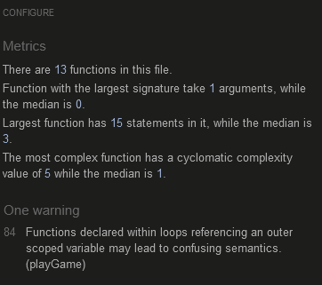

******

### Lighthouse

The Lighthouse tool in Chrome Dev Tools was used to test the performance, accessibility, best practices and search engine results (SEO) ranking of the website.

Mobile Results

Desktop Results

******

### Devices Used

**Mobile**
iPhone 11 Pro was used to test the mobile features of the website.

**Desktop**
Acer Aspire 5 A515 was used to test the desktop features of the website

**Browsers**
The Safari browser was used for testing on mobile.

The Mozilla Firefox, Google Chrome and Microsoft Edge browsers were used for testing on desktop.

******

### Manual Testing

| Feature | Expected Outcome | Testing Performed | Result | Pass/Fail |
| --- | --- | --- | --- | --- |
| Start Button | Display Game Interface | Clicked Start button | Game Interface displayed | Pass |
| Reset Button | Display Instructions Interface, reset scores | Clicked Reset button | Instructions interface displayed, scores reset | Pass |
| Higher Button | Higher logic to run, dice to roll, result to display | Clicked Higher button, checked console message in dev tools | Console message displays "Higher", dice rolled, result displays | Pass |
| Lower Button | Lower logic to run, dice to roll, result to display | Clicked Lower button, checked console message in dev tools | Console message displays "Lower", dice rolled, result displays | Pass |
| Correct Result | Result element to display "Correct" message | Forced the answer to be correct | Result element displays "Correct" message | Pass |
| Incorrect Result | Result element to display "Incorrect" message | Forced the answer to be incorrect | Result element displays "Incorrect" message | Pass |
| Score | Score element to increment by one with each consecutive correct answer, reset to zero on incorrect answer | Played game as normal | Score increased by one for each consecutive correct answer and reset to zero when answer was incorrect | Pass |
| Best Streak | Best streak to update when score is higher than current best streak | Played game and got scores of three, five and three. | Best streak updated from zero to three, then three to five, then stayed at five | Pass |

[*Back to top*](#contents)

## Issues/Bugs

### Fixed Issues

| Issue | How It Was Resolved | Fixed? |
| Total was sometimes displaying incorrect value | The while statement in the playGame function was incorrect giving the newTotal variable a random number between one and six. The newNumber variables have now been added with the newTotal variable adding these and outputting the correct number | Fixed |
| JSHint validator showing empty header element | Heading element changed to a paragraph element to solve this | Fixed |

### Known Bugs

No known bugs at this current stage.

[*Back to top*](#contents)

******

## Credits

### Help Used

[Tyler Potts - YouTube (DAY 8 - How to code a Number Game in Javascript)](https://www.youtube.com/watch?v=kMmtRm4P_EE&t=1205s) - For the idea of a higher/Lower game and some of the  Javascript used.

[Code Institute](https://learn.codeinstitute.net/courses/course-v1:CodeInstitute+LM101+3/courseware/2d651bf3f23e48aeb9b9218871912b2e/8775beaed6ed403d92318845af971b30/) - For calculating the total of dice correctly using parseInt and values.

[JavaScript Academy - YouTube (Build Your Own Memory Card Game with HTML, CSS, and JavaScript - Beginner-Friendly Tutorial)](https://www.youtube.com/watch?v=xWdkt6KSirw) - For displaying the dice images using template literal.

[W3schools.com](https://www.w3schools.com/jsref/met_win_settimeout.asp) - For using the setTimeout function

******

### Media

[Pexels](https://www.pexels.com/) - For stock image used for background image.

[Pixabay](https://pixabay.com/) - For the dice stock images used.

[Icon8](https://icons8.com/icon/V9uXXBDWkesz/cycling-mountain-bike-skin-type-3) - For the FavIcon.

******

### Acknowledgements

Dick Vlaanderen (Mentor) - For the advice and encouragement I have received throughout the creation of the game.

The Slack community - For help needed with various questions and problems I had throughout the project.

Friends and Family - For helping me test the website on various devices and giving feedback throughout.

[*Back to top*](#contents)